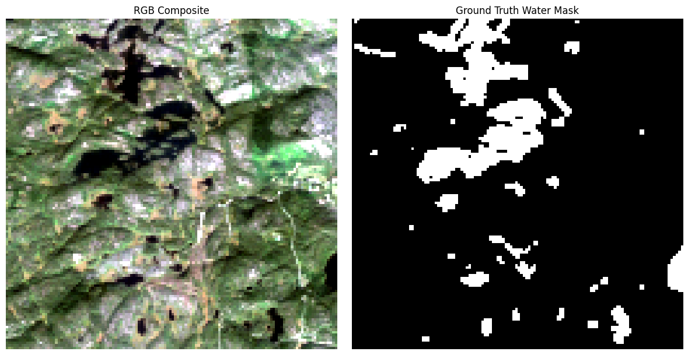
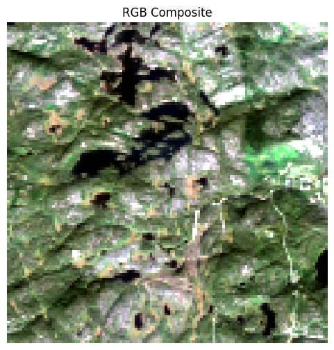
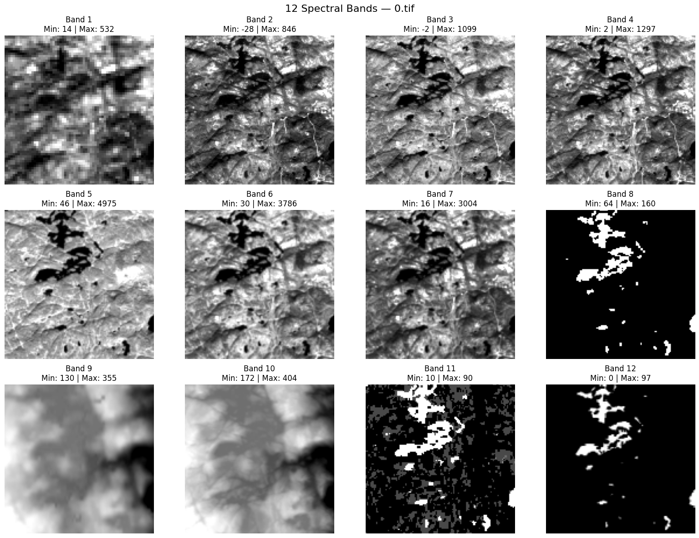
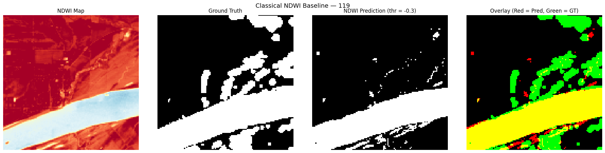
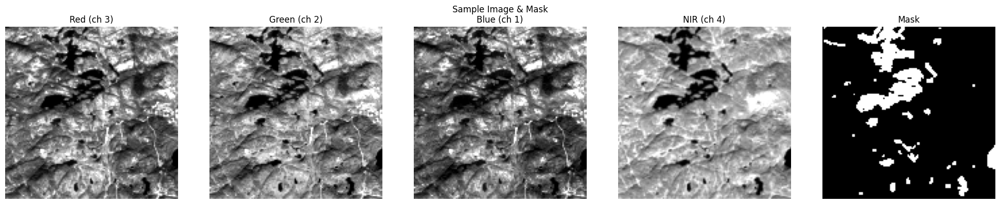
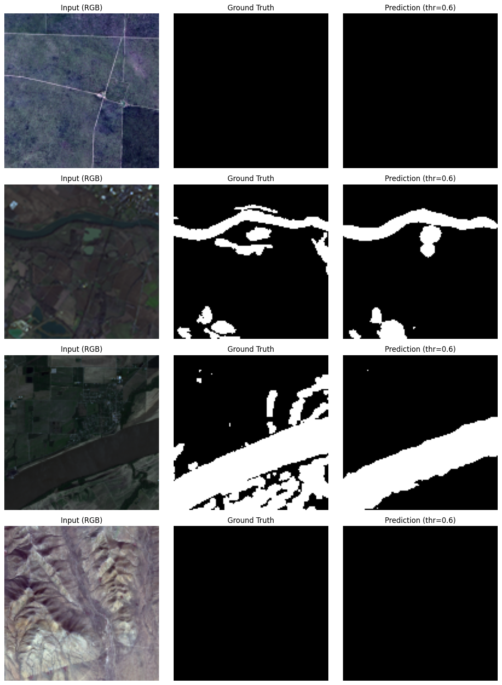
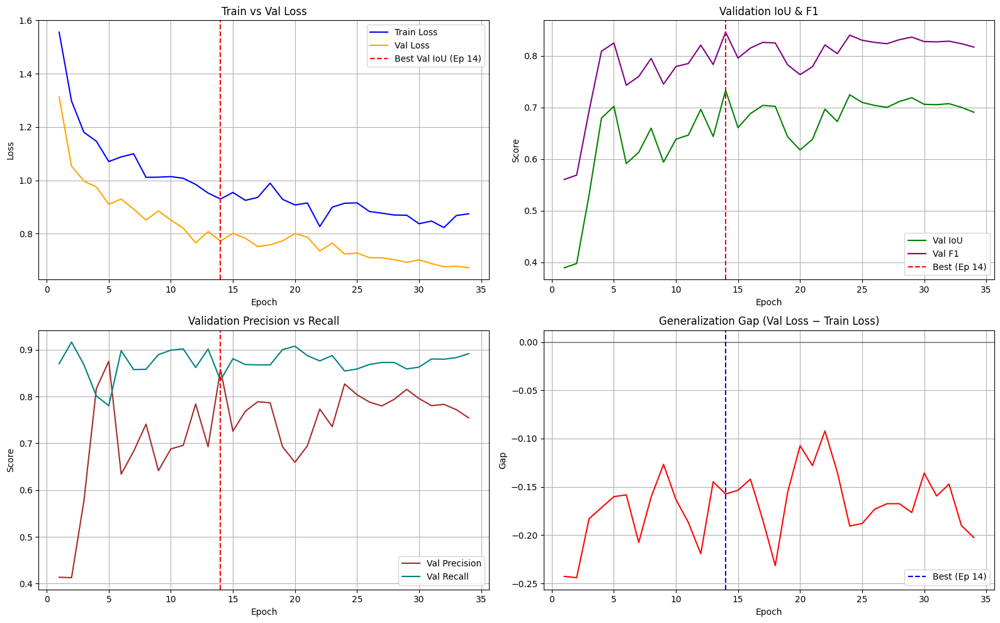
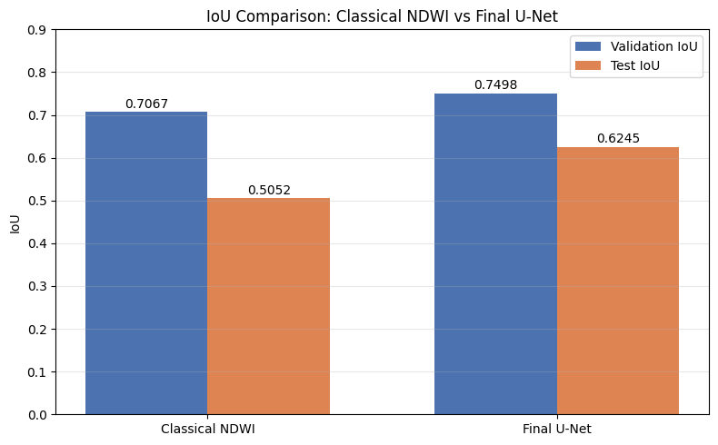
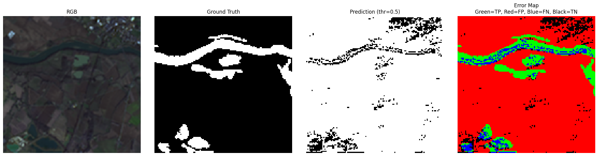

# 🌊 Water Segmentation Using Multispectral and Optical Data

A deep-learning semantic segmentation project for detecting water bodies from **12-channel satellite raster data**. The project covers both **U-Net models trained from scratch in PyTorch** and **pretrained U-Net models with a ResNet34 ImageNet encoder**, together with a classical **NDWI threshold baseline** for comparison.

<p align="center">
  
</p>

---

## 🎯 Project Overview

The goal of this project is **binary semantic segmentation of water pixels** from multispectral / optical satellite imagery.

Each input sample is a `128 × 128` raster with **12 channels**, while the target is a binary mask:

* `0` → Background
* `1` → Water

The repository documents a full experimental pipeline:

```text
EDA
 ↓
NDWI Baseline
 ↓
12-Channel Scratch U-Net Baseline
 ↓
Feature Engineering / Channel Ablation
 ↓
Final Scratch U-Net
 ↓
Independent Test Evaluation
 ↓
Pretrained U-Net (ResNet34 ImageNet) Experiments
```

Both **from-scratch** and **pretrained** families of experiments are included, evaluated under explicitly separated data splits.

---

## 🛰️ Dataset

The dataset contains **306 image-mask pairs**.

| Property                |       Value |
| ----------------------- | ----------: |
| Raster Images           |         306 |
| Binary Masks            |         306 |
| Image Size              | `128 × 128` |
| Input Channels          |          12 |
| Images Containing Water |         261 |
| Images Without Water    |          45 |
| Water Pixels            |   1,302,272 |
| Background Pixels       |   3,711,232 |
| Water Coverage          |      25.98% |
| Background Coverage     |      74.02% |

The dataset is **not tracked inside the GitHub repository**. It is expected to be provided locally under:

```text
data/
├── images/
└── labels/
```

### Channel Configuration

| Index | Channel                      |
| ----: | ---------------------------- |
|     0 | Coastal Aerosol              |
|     1 | Blue                         |
|     2 | Green                        |
|     3 | Red                          |
|     4 | NIR                          |
|     5 | SWIR1                        |
|     6 | SWIR2                        |
|     7 | QA                           |
|     8 | MERIT DEM                    |
|     9 | Copernicus DEM               |
|    10 | ESA WorldCover               |
|    11 | Water Occurrence Probability |

### RGB Visualization

```text
RGB = [3, 2, 1]
```

i.e. Red → channel 3, Green → channel 2, Blue → channel 1.

---

## 🧪 Preprocessing

Preprocessing is performed consistently across the notebooks:

* Dataset-level **channel statistics are computed from the training set only**.
* Continuous channels are normalized using **training-set statistics**.
* `QA` (channel 7) and `ESA WorldCover` (channel 10) are **categorical / discrete** channels and are not treated as continuous spectral channels.
* Valid negative spectral values are preserved; they are not treated as invalid.
* `SEED = 42` is used for reproducibility.

> Note: whether invalid MERIT DEM sentinel values (e.g. `-9999`) are handled before normalization in every preprocessing path has **not** been independently verified from the current notebooks. See the [Limitations](#️-limitations) section.

### NDWI

NDWI is derived from Green and NIR:

```text
NDWI = (Green − NIR) / (Green + NIR + 1e-6)
```

with:

```text
Green = channel 2
NIR   = channel 4
```

For the **pretrained final experiment**, the input becomes:

```text
12 raw channels + NDWI = 13 input channels
```

---

## 📁 Repository Structure

```text
WaterSegmentation/
│
├── data/                      # expected locally, not tracked in the repo
│   ├── images/
│   └── labels/
│
├── notebooks/
│   ├── PretrainedModel/
│   │   ├── Baseline_Pretrained_12_Channels.ipynb
│   │   ├── Final_Model_80_20_Validation.ipynb
│   │   └── Final_Model_Independent_Test.ipynb
│   │
│   └── U-Net_FromScratch/
│       ├── EDA.ipynb
│       ├── Baseline_UNet_12_Channels.ipynb
│       ├── Feature_Engineering_and_Ablation.ipynb
│       ├── Final_Model_80_20_Validation.ipynb
│       └── Final_Model_Independent_Test.ipynb
│
├── figures/
└── README.md
```

---

## 🔬 Exploratory Data Analysis

`notebooks/U-Net_FromScratch/EDA.ipynb` covers:

* Channel distributions and ranges
* RGB composites
* Ground-truth mask inspection
* Per-image statistics
* Channel correlations
* Categorical vs. continuous feature behavior
* Invalid DEM value handling

<p align="center">
  
</p>

<p align="center">
  
</p>

---

## 🧪 Classical Baseline — NDWI

A classical **NDWI thresholding baseline** was implemented before any deep-learning training.

NDWI:

```python
NDWI = (Green - NIR) / (Green + NIR + 1e-6)
```

The threshold was selected on the validation split.

| Metric | Validation |   Test |
| ------ | ---------: | -----: |
| IoU    |     0.7067 | 0.5052 |
| F1     |     0.8282 | 0.6712 |

Selected threshold:

```text
Threshold = -0.3
```

<p align="center">
  
</p>

This baseline provides a reference for whether deep-learning segmentation improves over a simple spectral index rule.

---

## 🧠 From-Scratch U-Net Experiments

All notebooks in this family are under `notebooks/U-Net_FromScratch/`. The models are U-Nets implemented from scratch in PyTorch.

### Baseline U-Net — 12 Channels (70/15/15)

Notebook: `Baseline_UNet_12_Channels.ipynb`

Input: **12 raw channels**.

| Metric    | Validation |   Test |
| --------- | ---------: | -----: |
| IoU       |     0.6176 | 0.6475 |
| F1        |          — | 0.7861 |
| Accuracy  |          — | 0.9117 |
| Precision |          — | 0.8428 |
| Recall    |          — | 0.7365 |

### Feature Engineering & Channel Ablation (70/15/15)

Notebook: `Feature_Engineering_and_Ablation.ipynb`

Two distinct stages are reported:

1. **Channel screening / selection** stage (validation-based selection):
   ```text
   Screening IoU ≈ 0.6305
   ```
   This is a **selection-stage** score, not the final model score, and not an independent-test result.

2. **Final retraining of the selected configuration**:

| Metric    | Validation |   Test |
| --------- | ---------: | -----: |
| IoU       |     0.6453 | 0.6505 |
| F1        |     0.7844 | 0.7882 |
| Precision |     0.8075 | 0.8498 |
| Recall    |     0.7626 | 0.7350 |
| Accuracy  |          — | 0.9130 |

### Final Scratch U-Net — Independent Test (80/10/10)

Notebook: `Final_Model_Independent_Test.ipynb`

Split:

```text
80% Train / 10% Validation / 10% Test
```

Input: **12 raw channels + NDWI (13 channels)**.

After **validation threshold tuning**:

```text
Best threshold  = 0.6
Validation IoU  = 0.7479
Validation F1   = 0.8558
```

Independent test at the selected threshold:

| Metric    | Value  |
| --------- | -----: |
| Test IoU  | 0.5206 |
| Test F1   | 0.6848 |
| Precision | 0.9091 |
| Recall    | 0.5492 |
| Accuracy  | 0.8620 |

### Final Scratch U-Net — 80/20 Validation

Notebook: `Final_Model_80_20_Validation.ipynb`

Split:

```text
80% Train / 20% Validation
No independent test set.
```

Best validation result:

| Metric         | Value  |
| -------------- | -----: |
| Validation IoU | 0.6991 |

No test score is reported for this notebook, because none exists.

---

## 🚀 Pretrained U-Net Experiments

All notebooks in this family are under `notebooks/PretrainedModel/`.

Approach:

```text
U-Net
+ ResNet34 encoder
+ ImageNet pretrained weights
+ Multispectral channel adaptation
```

The library used is **`segmentation-models-pytorch`**.

### Multispectral Adaptation — Weight Averaging

The RGB ResNet34 first convolution is adapted to the multispectral input using **weight averaging**:

```text
Original Conv1 weights = [64, 3, 7, 7]

Average RGB input-channel weights:
[64, 3, 7, 7] → [64, 1, 7, 7]

Repeat across the required number of input channels:
[64, 1, 7, 7] → [64, N, 7, 7]
```

where `N` is `12` or `13` depending on the experiment.

No other pretrained adaptation strategy is claimed unless it exists in the current notebooks.

### Pretrained Baseline — 12 Channels (70/15/15)

Notebook: `Baseline_Pretrained_12_Channels.ipynb`

| Setting    | Value                     |
| ---------- | ------------------------- |
| Input      | 12 channels               |
| Model      | U-Net + ResNet34 ImageNet |
| Adaptation | Weight Averaging          |
| Threshold  | 0.5                       |

| Metric | Validation |   Test |
| ------ | ---------: | -----: |
| IoU    |     0.6884 | 0.7071 |
| F1     |          — | 0.8284 |

This is currently the **highest reported independent-test IoU in the project**, and it comes from the **70/15/15 split**. It should not be directly compared against experiments using a different split as if they were under identical conditions.

### Pretrained Final — 13 Channels (80/10/10)

Notebook: `Final_Model_Independent_Test.ipynb`

| Setting    | Value                       |
| ---------- | --------------------------- |
| Input      | 12 raw channels + NDWI (13) |
| Model      | U-Net + ResNet34 ImageNet   |
| Adaptation | Weight Averaging            |

Checkpoint selection metrics (threshold = 0.5):

```text
Validation IoU = 0.8204
Validation F1  = 0.9013
```

Validation threshold tuning selected:

```text
Best threshold = 0.7
```

Validation metrics at the tuned threshold:

```text
Validation IoU = 0.8258
Validation F1  = 0.9046
```

Independent test at threshold `0.7`:

| Metric    | Value  |
| --------- | -----: |
| Test IoU  | 0.6709 |
| Test F1   | 0.8030 |
| Precision | 0.8941 |
| Recall    | 0.7288 |
| Accuracy  | 0.9024 |

> Note on metric interpretation:
> * `0.8204` is the **checkpoint-selection** validation IoU at threshold `0.5`.
> * `0.8258` is the **threshold-tuned** validation IoU at threshold `0.7`.
> * `0.6709` is the **independent test IoU** at threshold `0.7`.
> These three numbers refer to different selection stages and should not be conflated. The threshold was selected using validation data only; the test set was not used to tune the threshold.

### Pretrained — 80/20 Validation

Notebook: `Final_Model_80_20_Validation.ipynb`

Split:

```text
80% Train / 20% Validation
No independent test set.
```

Best validation result:

| Metric         | Value  |
| -------------- | -----: |
| Validation IoU | 0.8159 |

No test result is reported from this notebook.

---

## 📊 Experiment Comparison

| Experiment                     | Model                       | Input                      | Split    | Val IoU | Test IoU | Test F1 | Threshold |
| ------------------------------ | --------------------------- | -------------------------- | -------- | ------: | -------: | ------: | --------: |
| NDWI Baseline                  | NDWI threshold              | NDWI                       | 70/15/15 |  0.7067 |   0.5052 |  0.6712 |    −0.3   |
| Scratch Baseline               | U-Net (scratch)             | 12 raw                     | 70/15/15 |  0.6176 |   0.6475 |  0.7861 |     0.5   |
| Scratch Feature Eng. (retrain) | U-Net (scratch)             | 12 selected + NDWI + MNDWI | 70/15/15 |  0.6453 |   0.6505 |  0.7882 |     0.5   |
| Scratch Final (Indep. Test)    | U-Net (scratch)             | 12 raw + NDWI              | 80/10/10 |  0.7479 |   0.5206 |  0.6848 |     0.6   |
| Scratch Final (80/20 Val.)     | U-Net (scratch)             | 12 raw + NDWI              | 80/20    |  0.6991 |        — |       — |     0.6   |
| Pretrained Baseline            | U-Net + ResNet34 (ImageNet) | 12 raw                     | 70/15/15 |  0.6884 |   0.7071 |  0.8284 |     0.5   |
| Pretrained Final (Indep. Test) | U-Net + ResNet34 (ImageNet) | 12 raw + NDWI              | 80/10/10 |  0.8258 |   0.6709 |  0.8030 |     0.7   |
| Pretrained (80/20 Val.)        | U-Net + ResNet34 (ImageNet) | 12 raw + NDWI              | 80/20    |  0.8159 |        — |       — |     0.5   |

> **Important:** these experiments use **different data splits** and evaluation protocols. Do not merge them into a single misleading leaderboard. Validation and test metrics across different splits are not directly comparable.

> **Footnote on Pretrained Final (Indep. Test) row:** `Val IoU = 0.8258` is the **threshold-tuned** validation IoU at threshold `0.7`. The **checkpoint-selection** validation IoU was `0.8204` at threshold `0.5`. These are different evaluation stages and should not be conflated.

> **Footnote on Scratch Final (Indep. Test) row:** `Val IoU = 0.7479` is the **threshold-tuned** validation IoU at threshold `0.6`.

### Interpretation

* The **highest reported independent-test IoU** among the evaluated configurations is the **Pretrained Baseline (12 channels, 70/15/15)** with `Test IoU = 0.7071`.
* The **best final pretrained configuration** on the independent **80/10/10** evaluation is the **13-channel (12 + NDWI)** model with `Test IoU = 0.6709` and `Test F1 = 0.8030`.
* Under the **80/10/10 protocol** (the closest thing to a controlled comparison here):

  ```text
  Scratch Final    : Val IoU = 0.7479, Test IoU = 0.5206
  Pretrained Final : Val IoU = 0.8258, Test IoU = 0.6709
  ```

* Under the evaluated 80/10/10 protocol, the **pretrained ResNet34 U-Net configuration achieved higher independent-test performance than the evaluated scratch U-Net configuration**. This is a comparison of evaluated configurations, **not** a controlled pretraining-only ablation, because architecture and training configuration differ as well.

---

## 🖼️ Visual Results

Figures should be interpreted in the context of the specific experiment they belong to.

### RGB + Ground Truth

<p align="center">
  
</p>

### Multispectral Information

<p align="center">
  
</p>

### U-Net Prediction

Prediction visualization for the corresponding U-Net experiment. Refer to the notebook that generated the figure for the exact split and model configuration.

<p align="center">
  
</p>

### Training Curves

<p align="center">
  
</p>

### NDWI vs U-Net

This figure compares the classical NDWI baseline against a U-Net prediction. Use the values from the current notebooks as the source of truth for this comparison.

<p align="center">
  
</p>

### Error Visualization

<p align="center">
  
</p>

---

## 🧠 Key Findings

1. **Spectral indices help but are not sufficient on their own.** The NDWI baseline fits the validation threshold well but generalizes less strongly to unseen scenes.
2. **Channel selection changes the input representation.** Removing some channels and adding spectral indices produced a competitive representation during feature engineering.
3. **Evaluation protocol matters.** The project contains experiments with different splits (70/15/15, 80/10/10, 80/20). Metrics must always be interpreted together with their evaluation setup.
4. **Independent testing reveals a generalization gap.** Models with strong validation metrics can still lose significant IoU on a held-out test set, especially when the split is smaller.
5. **Pretrained vs. scratch under the 80/10/10 protocol.** Under the evaluated 80/10/10 protocol, the pretrained ResNet34 U-Net configuration achieved higher independent-test performance than the evaluated scratch U-Net configuration. This is a comparison of evaluated configurations, **not** a controlled pretraining-only ablation — architecture and training configuration also differ.

---

## 🔧 Technical Details

<details>
<summary><strong>Baseline Scratch U-Net Configuration</strong></summary>

| Parameter               | Value             |
| ----------------------- | ----------------- |
| Input Channels          | 12                |
| Output Channels         | 1                 |
| Base Filters            | 8                 |
| Depth                   | 6                 |
| Loss                    | BCEWithLogitsLoss |
| Optimizer               | Adam              |
| Learning Rate           | `1e-4`            |
| Batch Size              | 8                 |
| Maximum Epochs          | 60                |
| Early Stopping Patience | 10                |

Augmentation:

```text
Horizontal Flip
Vertical Flip
Rot90
Numerical Channel Noise = 0.05
```

</details>

<details>
<summary><strong>Final Scratch U-Net Configuration</strong></summary>

### Shared Architecture

```text
Input Channels = 13 (12 raw + NDWI)
Base Filters   = 32
Depth          = 5
Dropout        = 0.1
Output         = 1
Loss           = BCE + Dice
Optimizer      = AdamW
Learning Rate  = 1e-4
```

### Final Scratch — Independent Test (80/10/10)

| Parameter         | Value             |
| ----------------- | ----------------- |
| Split             | 80/10/10          |
| Optimizer         | AdamW             |
| Learning Rate     | `1e-4`            |
| Weight Decay      | `1e-4`            |
| Batch Size        | 8                 |
| `pos_weight`      | ≈ 2.8228          |
| Scheduler         | CosineAnnealingLR |
| Gradient Clipping | 1.0               |
| Early Stopping    | 20                |
| Maximum Epochs    | 100               |
| Selection Metric  | Validation IoU    |

### Final Scratch — 80/20 Validation

| Parameter          | Value             |
| ------------------ | ----------------- |
| Split              | 80/20             |
| Optimizer          | AdamW             |
| Learning Rate      | `1e-4`            |
| Weight Decay       | `1e-4`            |
| Batch Size         | 8                 |
| `pos_weight`       | ≈ 2.8200          |
| Scheduler          | ReduceLROnPlateau |
| Scheduler Factor   | 0.5               |
| Scheduler Patience | 5                 |
| Minimum LR         | `1e-7`            |
| Gradient Clipping  | 1.0               |
| Early Stopping     | 20                |
| Maximum Epochs     | 100               |
| Selection Metric   | Validation IoU    |

</details>

<details>
<summary><strong>Pretrained U-Net Configuration</strong></summary>

```text
Model       = U-Net (segmentation-models-pytorch)
Encoder     = ResNet34
Weights     = ImageNet
Adaptation  = Weight averaging of Conv1 RGB weights
              [64, 3, 7, 7] → [64, 1, 7, 7] → [64, N, 7, 7]
```

`N = 12` for the baseline pretrained notebook, `N = 13` for the final pretrained notebook.

</details>

<details>
<summary><strong>Data Splits</strong></summary>

### 70/15/15 Split

```text
Train      = 214
Validation = 46
Test       = 46
```

Used by:
* NDWI baseline
* Scratch baseline
* Scratch feature engineering
* Pretrained baseline (12 channels)

### 80/10/10 Split

```text
Train      = 244
Validation = 31
Test       = 31
```

Used by:
* Scratch Final — Independent Test
* Pretrained Final — Independent Test

### 80/20 Split

```text
Train      = 244
Validation = 62
Test       = None
```

Used by:
* Scratch Final — 80/20 Validation
* Pretrained — 80/20 Validation

</details>

<details>
<summary><strong>Notebook Roles</strong></summary>

| Notebook                                                   | Purpose                                                                   |
| ---------------------------------------------------------- | ------------------------------------------------------------------------- |
| `U-Net_FromScratch/EDA.ipynb`                              | Dataset exploration, channel analysis, mask analysis, statistics          |
| `U-Net_FromScratch/Baseline_UNet_12_Channels.ipynb`        | Scratch U-Net on 12 raw channels (70/15/15)                               |
| `U-Net_FromScratch/Feature_Engineering_and_Ablation.ipynb` | Feature engineering, channel ablation, greedy channel search              |
| `U-Net_FromScratch/Final_Model_80_20_Validation.ipynb`     | Final scratch U-Net, 80/20 split, validation-only                         |
| `U-Net_FromScratch/Final_Model_Independent_Test.ipynb`     | Final scratch U-Net, 80/10/10 split, independent test                     |
| `PretrainedModel/Baseline_Pretrained_12_Channels.ipynb`    | U-Net + ResNet34 ImageNet on 12 raw channels (70/15/15)                   |
| `PretrainedModel/Final_Model_80_20_Validation.ipynb`       | Final pretrained U-Net, 80/20 split, validation-only                      |
| `PretrainedModel/Final_Model_Independent_Test.ipynb`       | Final pretrained U-Net, 13 channels (12 + NDWI), 80/10/10, independent test |

</details>

---

## ⚠️ Limitations

* **Different splits across experiments.** Some results come from 70/15/15, others from 80/10/10 or 80/20, so not all metrics are directly comparable.
* **Feature / channel selection and threshold tuning were performed using the validation split.** The resulting validation metrics may therefore be optimistically biased relative to independent-test performance. This is validation-set optimization, **not** test leakage.
* **Scratch vs. pretrained is not a fully controlled ablation**, because architecture and training configuration differ in addition to the encoder initialization.
* **DEM NoData handling is not independently verified.** Whether invalid MERIT DEM sentinel values (e.g. `-9999`) are handled before normalization in every preprocessing path has not been verified from the current notebooks and should be confirmed before relying on DEM-derived statistics.
* **No scene-level or group-level splitting** is used, if applicable in the current implementation. Nearby scenes may therefore appear in both training and evaluation.
* **Dataset-level generalization** would require evaluation on additional geographic scenes beyond the current dataset.
* **The dataset itself is not tracked in the repository** and must be provided locally under `data/images/` and `data/labels/`.
* **Reproducibility depends partly on local/Colab paths** used in the notebooks; the notebooks are not fully self-contained.

These are methodological limitations, not bugs in the code.

---

## 🚀 How to Run

### Install Dependencies

```bash
pip install torch torchvision rasterio numpy pandas matplotlib scikit-learn segmentation-models-pytorch
```

Additional visualization / notebook dependencies (e.g. `seaborn`, `pillow`) can be installed as needed.

A CUDA-capable GPU is recommended for training.

### Notebook Order

```text
U-Net_FromScratch/EDA.ipynb
        ↓
U-Net_FromScratch/Baseline_UNet_12_Channels.ipynb
        ↓
U-Net_FromScratch/Feature_Engineering_and_Ablation.ipynb
        ↓
U-Net_FromScratch/Final_Model_Independent_Test.ipynb
        ↓
U-Net_FromScratch/Final_Model_80_20_Validation.ipynb
        ↓
PretrainedModel/Baseline_Pretrained_12_Channels.ipynb
        ↓
PretrainedModel/Final_Model_Independent_Test.ipynb
        ↓
PretrainedModel/Final_Model_80_20_Validation.ipynb
```

Make sure the dataset is available locally under:

```text
data/
├── images/
└── labels/
```

before running the notebooks.

The project uses:

```text
SEED = 42
```

for reproducibility.

---

## 🛠️ Tech Stack

```text
Python
PyTorch
torchvision
rasterio
numpy
pandas
matplotlib
scikit-learn
segmentation-models-pytorch
```

---

## 👤 Author

**Mahmoud Shoaib**

AI Engineer

[GitHub](https://github.com/mahmoudshoip94)
[LinkedIn](https://www.linkedin.com/in/mahmoud-shoaib-7040ba300/)

---

## 📌 Project Summary

This repository documents a complete experimental progression for water segmentation from multispectral satellite imagery:

```text
Satellite Data (12 channels)
        ↓
EDA
        ↓
Preprocessing (train-set statistics, categorical channels)
        ↓
NDWI Baseline
        ↓
Scratch U-Net Baseline
        ↓
Feature Engineering / Channel Ablation
        ↓
Final Scratch U-Net (80/10/10 and 80/20)
        ↓
Pretrained U-Net + ResNet34 ImageNet (12 and 13 channels)
        ↓
Independent Test Evaluation
```

The **highest reported independent-test IoU** among the evaluated configurations is **0.7071**, achieved by the **pretrained baseline (12 channels, 70/15/15)**. The **best final pretrained configuration** under the **80/10/10** protocol reaches **Test IoU = 0.6709** and **Test F1 = 0.8030** with a tuned threshold of `0.7`.

Under the evaluated 80/10/10 protocol, the pretrained ResNet34 U-Net configuration achieved higher independent-test performance than the evaluated scratch U-Net configuration. This is a comparison of evaluated configurations, **not** a controlled pretraining-only ablation.
