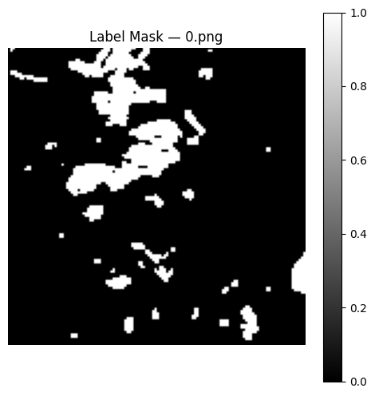
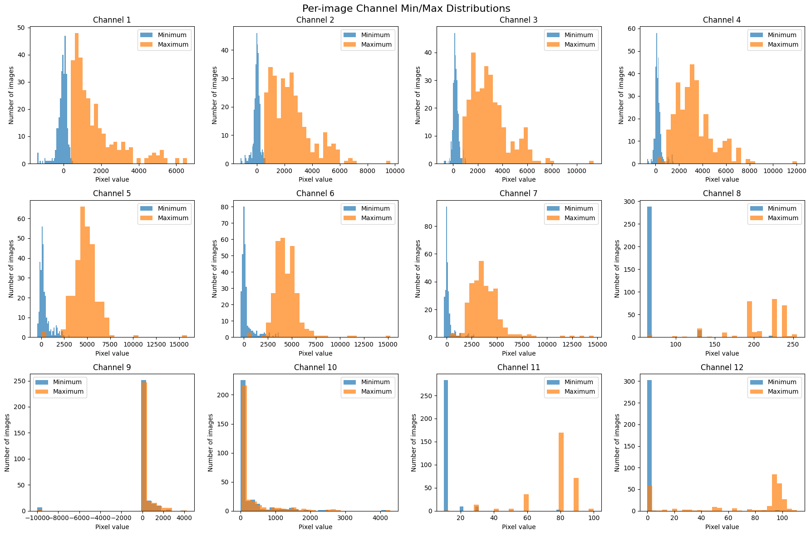
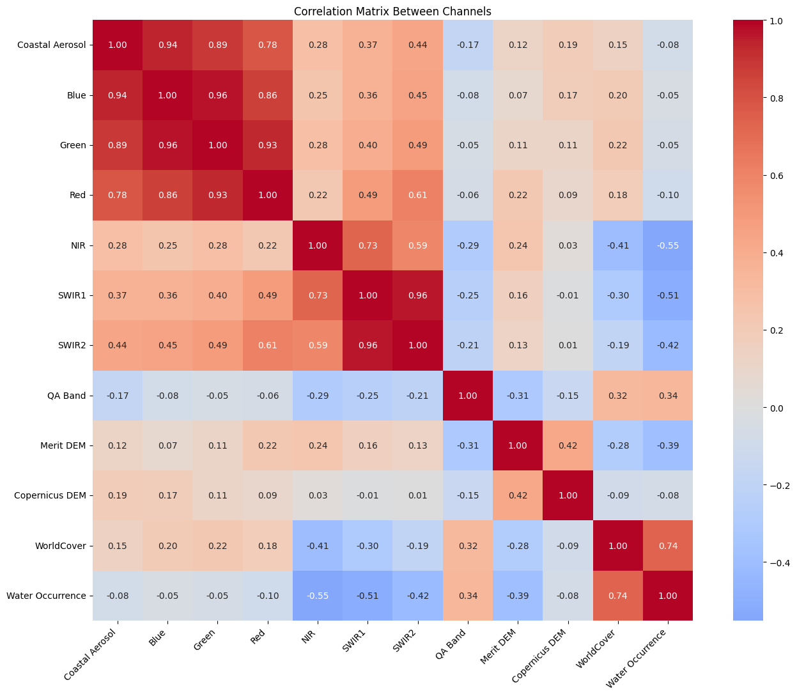

# Water Segmentation Using Multispectral and Optical Data

A deep-learning semantic segmentation project for detecting water pixels from 12-channel multispectral, optical, terrain, land-cover, and water-occurrence data. The model is a U-Net implemented from scratch in PyTorch, and the project also includes a classical NDWI threshold baseline for comparison.

---

## Project Summary

- **Task:** Binary water segmentation.
- **Input:** 12-channel raster data, with optional spectral indices such as NDWI.
- **Masks:** `0 = Background`, `1 = Water`.
- **Main model:** U-Net implemented from scratch in PyTorch.
- **Baseline:** Classical NDWI thresholding.
- **Final selected model:** 80/10/10 split, U-Net with NDWI feature, best validation checkpoint at epoch 14.
- **Final selected test results:** Test IoU `0.6245`, Test F1 `0.7689`.

The project covers dataset exploration, preprocessing, feature engineering, classical baseline evaluation, U-Net training, threshold tuning, experiment comparison, and final model selection.

---

## Dataset

The dataset consists of multispectral raster images and binary masks.

| Item | Value |
|---|---:|
| Multispectral `.tif` images | 306 |
| Binary `.png` masks | 306 |
| Image size | 128 × 128 |
| Input channels | 12 |
| Mask values | `0 = Background`, `1 = Water` |
| Images containing water | 261 |
| Images with no water | 45 |
| Total water pixels | 1,302,272 |
| Total background pixels | 3,711,232 |
| Water percentage | 25.98% |
| Background percentage | 74.02% |

### Channel Order

| Index | Channel |
|---:|---|
| 0 | Coastal Aerosol |
| 1 | Blue |
| 2 | Green |
| 3 | Red |
| 4 | NIR |
| 5 | SWIR1 |
| 6 | SWIR2 |
| 7 | QA Band |
| 8 | MERIT DEM |
| 9 | Copernicus DEM |
| 10 | ESA WorldCover |
| 11 | Water Occurrence Probability |

### RGB Visualization

For visualization:

- Red = channel 3
- Green = channel 2
- Blue = channel 1

### Categorical Channels

The following channels are treated as categorical and are **not normalized**:

- QA Band = channel 7
- ESA WorldCover = channel 10

The remaining 10 channels are continuous and are normalized.

### Invalid Value Handling

- MERIT DEM contains `-9999` values. These are treated as invalid and replaced using that channel’s mean.
- Normal negative spectral values were retained.
- Negative readings in spectral bands are not automatically treated as errors.
- The data are raster arrays used for image segmentation, not ordinary RGB images.

---

## Project Structure

The notebooks reference the following working structure:

```text
WaterSegmentation/
├── data/
│   ├── images/                       # 306 .tif images
│   ├── labels/                       # 306 .png masks
│   ├── channel_statistics.csv
│   ├── mask_statistics.csv
│   ├── channel_pixels_all.csv
│   ├── train_channel_stats.json
│   └── train_channel_stats_15ch.json
├── new_model_checkpoints/
│   ├── best_model.pth
│   ├── train_mean.npy
│   └── train_std.npy
├── notebooks/
│   ├── EDA.ipynb
│   ├── preprocessing.ipynb
│   ├── prepro&model_2.ipynb
│   └── final_model.ipynb
├── figures/
└── README.md
```

---

## Exploratory Data Analysis

The EDA notebook examined image channels, masks, per-image statistics, and channel relationships.

Key observations:

- All masks contain only `0` and `1`.
- Water is present in 261 images and absent in 45 images.
- Water covers approximately 25.98% of all pixels.
- QA Band and WorldCover behave as categorical features.
- Several continuous channels have different distributions and ranges.
- DEM channels contain invalid `-9999` values that require handling.

### EDA Figures


*RGB composite generated from Red, Green, and Blue channels.*


*Example binary water mask. White = water, black = background.*


*Representative visualization of the 12 input channels for one sample.*


*Per-image minimum and maximum distributions across channels.*


*Correlation matrix between all 12 channels.*

---

## Preprocessing

Preprocessing was implemented with `rasterio`, NumPy, and PyTorch.

### Main Steps

1. Read `.tif` images with `rasterio`.
2. Read binary `.png` masks.
3. Replace invalid MERIT DEM `-9999` values with the channel mean.
4. Preserve valid negative spectral values.
5. Compute dataset-wise, per-channel normalization statistics using only the training set.
6. Exclude QA Band and WorldCover from normalization.
7. Add spectral indices when enabled.
8. Apply optional augmentation only to the training set.
9. Use `SEED = 42` for reproducibility.

### Split

The final selected pipeline uses an 80/10/10 split:

| Split | Images |
|---|---:|
| Train | 244 |
| Validation | 31 |
| Test | 31 |
| Total | 306 |

No-water images are distributed across the splits:

| Split | No-water images |
|---|---:|
| Train | 35 |
| Validation | 5 |
| Test | 5 |

Stratification was used to preserve water/no-water distribution across splits.

---

## Feature Engineering

Spectral indices were explored during development.

### NDWI

```python
NDWI = (Green - NIR) / (Green + NIR + 1e-6)
```

Channel indices:

- Green = 2
- NIR = 4
- SWIR1 = 5

Other indices explored during development included:

- MNDWI
- NDMI
- Combinations of NDWI, MNDWI, and NDMI

Different feature configurations were tested. The final selected U-Net configuration uses:

- Raw 12 channels
- NDWI
- `USE_MNDWI = False`
- `USE_NDMI = False`

This gives a 13-channel input to the final selected U-Net.

---

## Classical NDWI Baseline

A simple rule-based baseline was implemented using raw Green and NIR values.

Threshold search:

```python
thresholds = [-0.5, -0.4, -0.3, -0.2, -0.1, 0.0, 0.1, 0.2, 0.3, 0.4, 0.5, 0.6]
```

The threshold was selected using the validation set only.

**Best validation threshold:** `-0.3`

### Classical NDWI Results

| Metric | Value |
|---|---:|
| Validation IoU | 0.7067 |
| Validation F1 | 0.8282 |
| Test IoU | 0.5052 |
| Test F1 | 0.6712 |

The best NDWI threshold was selected on validation and then evaluated on the test set without re-tuning.

---

## Deep Learning Model

The main model is a U-Net implemented from scratch in PyTorch.

### Architecture Details

- No pretrained encoder.
- Input channel count is dynamic.
- Final selected configuration uses 13 input channels: 12 raw + NDWI.
- Output: 1-channel binary segmentation logits.
- Encoder, bottleneck, decoder, and skip connections.
- Dropout used during training.
- Final `1×1` convolution produces logits.
- Sigmoid is applied at evaluation time for binary prediction.

### U-Net Configuration Used in Final Notebook

| Setting | Value |
|---|---:|
| Base filters | 32 |
| Depth | 5 |
| Dropout | 0.1 |
| Input size | 128 × 128 |
| Output channels | 1 |

The encoder blocks use two `3×3` convolutions with batch normalization and ReLU, followed by optional dropout. Downsampling uses max pooling. The decoder uses transposed convolutions, skip concatenation, and convolutional blocks.

---

## Training

Training was performed in PyTorch.

### Main Training Settings

| Setting | Value |
|---|---:|
| Optimizer | Adam |
| Learning rate | `1e-4` |
| Weight decay | `1e-4` |
| Batch size | 8 |
| Loss | BCE + Dice |
| Scheduler | CosineAnnealingLR |
| Gradient clipping | 1.0 |
| Mixed precision | Enabled when CUDA is available |
| Seed | 42 |
| Model selection | Best validation IoU |
| Early stopping | Enabled |

Additional details:

- `pos_weight` was computed from the training set.
- `pos_weight(train)` was approximately `2.8228`.
- Best-model checkpointing was used.
- Training used up to 100 epochs with early stopping.
- The selected final model reached its best validation checkpoint at epoch 14.
- Training stopped by early stopping at epoch 34.

---

## Threshold Tuning

The U-Net output threshold was tuned on the validation set.

| Threshold | IoU | F1 | Precision | Recall | Accuracy |
|---:|---:|---:|---:|---:|---:|
| 0.3 | 0.6928 | 0.8185 | 0.7737 | 0.8688 | 0.9105 |
| 0.4 | 0.7240 | 0.8399 | 0.8311 | 0.8488 | 0.9249 |
| 0.5 | 0.7498 | 0.8570 | 0.8971 | 0.8203 | 0.9364 |
| 0.6 | 0.7420 | 0.8519 | 0.9508 | 0.7716 | 0.9377 |
| 0.7 | 0.7222 | 0.8387 | 0.9649 | 0.7416 | 0.9338 |

**Best validation threshold:** `0.5`

Threshold `0.5` was selected for this experiment. It is not claimed to be universally optimal.

---

## Experiment History

Several experiments were performed during development. The table below summarizes the main documented runs.

| Experiment | Validation IoU | Validation F1 | Test IoU | Test F1 | Notes |
|---|---:|---:|---:|---:|---|
| Earlier U-Net | 0.6176 | — | 0.6730 | 0.8045 | Early stopping around epoch 52 |
| Feature-engineering run | — | — | 0.6375 | 0.7787 | Test Accuracy `0.9075`, Precision `0.8231`, Recall `0.7388` |
| 80/10/10 + NDWI baseline: Classical NDWI | 0.7067 | 0.8282 | 0.5052 | 0.6712 | Best validation threshold `-0.3` |
| 80/10/10 + NDWI baseline: U-Net | 0.7498 | 0.8570 | 0.6245 | 0.7689 | Selected final model; best epoch 14; stopped at epoch 34 |
| Later experimental run | 0.7508 | 0.8576 | 0.5258 | 0.6892 | Best epoch 57; did not outperform selected model on test |

### Later Experimental Run — More Detail

A later run produced:

| Metric | Value |
|---|---:|
| Validation IoU | 0.7508 |
| Validation F1 | 0.8576 |
| Test IoU | 0.5258 |
| Test F1 | 0.6892 |
| Test Precision | 0.8935 |
| Test Recall | 0.5610 |
| Test Accuracy | 0.8620 |
| Best validation epoch | 57 |

This run did **not** outperform the selected final model on the held-out test set. It is documented here for transparency.

---

## Selected Final Model

The selected final model is:

### Final Selected U-Net

| Item | Value |
|---|---:|
| Split | 80/10/10 |
| Input | 12 raw channels + NDWI |
| Best validation checkpoint | Epoch 14 |
| Validation IoU | 0.7498 |
| Validation F1 | 0.8570 |
| Test IoU | 0.6245 |
| Test F1 | 0.7689 |
| Test Precision | 0.8658 |
| Test Recall | 0.6914 |

The final checkpoint was selected based on the best validation IoU within the selected experiment. The test set was then used to report final performance. A later experiment was documented separately and was not selected for the final reported model.

---

## Results

| Metric | Classical NDWI | Final U-Net |
|---|---:|---:|
| Validation IoU | 0.7067 | 0.7498 |
| Validation F1 | 0.8282 | 0.8570 |
| Test IoU | 0.5052 | 0.6245 |
| Test F1 | 0.6712 | 0.7689 |

Final U-Net test precision and recall:

| Metric | Value |
|---|---:|
| Test Precision | 0.8658 |
| Test Recall | 0.6914 |

The U-Net achieved higher test IoU and F1 than the classical NDWI baseline in the selected experiment.

---

## Visualizations for GitHub

The following figures are recommended for the repository. Save them under `figures/` using the filenames below.

### Figure 1 — RGB + Ground Truth


*RGB composite and corresponding binary water mask.*

### Figure 2 — Multispectral Bands


*Representative Green, Red, NIR, SWIR1, DEM, and Water Occurrence channels.*

### Figure 3 — NDWI Baseline


*NDWI map, ground truth, and thresholded prediction using threshold `-0.3`.*

### Figure 4 — U-Net Prediction


*RGB, ground truth, U-Net prediction, and overlay.*

### Figure 5 — Training Curves


*Training loss, validation loss, validation IoU, and validation F1.*

### Figure 6 — NDWI vs U-Net


*Validation IoU and Test IoU comparison between classical NDWI and U-Net.*

### Figure 7 — Error Visualization


*RGB, ground truth, prediction, and error map. Error map convention: Green = True Positive, Red = False Positive, Blue = False Negative, Black = True Negative.*

---

## Limitations

- Dataset size is small: 306 image-mask pairs.
- Validation and test performance can vary between runs.
- Some images contain no water, which can affect per-scene metrics.
- Performance can vary substantially across scenes.
- The model is trained from scratch without a pretrained encoder.
- Threshold selection is based on the validation set and may not generalize to all scenes.

---

## How to Run

### Dependencies

Install the required Python packages:

```bash
pip install numpy pandas rasterio scikit-learn matplotlib seaborn pillow torch
```

A CUDA-capable GPU is recommended for training.

### Running the Project

1. Clone the repository.
2. Mount Google Drive or update `DATA_DIR` to your local dataset path.
3. Run the notebooks in order:
   - `EDA.ipynb`
   - `preprocessing.ipynb`
   - `prepro&model_2.ipynb`
   - `final_model.ipynb`
4. Checkpoints and normalization statistics are saved under `new_model_checkpoints/`.
5. Final selected model checkpoint: `new_model_checkpoints/best_model.pth`.

The project uses `SEED = 42` for reproducibility.

---

## Conclusion

This project implemented and evaluated a multispectral water segmentation pipeline using 12-channel raster data. A classical NDWI threshold baseline was compared against a U-Net trained from scratch in PyTorch. Feature engineering explored NDWI, MNDWI, and NDMI, with the final selected U-Net using the 12 raw channels plus NDWI.

On the selected 80/10/10 experiment, the U-Net achieved Test IoU `0.6245` and Test F1 `0.7689`, outperforming the classical NDWI baseline on the held-out test set. The project documents preprocessing, normalization, invalid DEM handling, threshold tuning, experiment history, and model selection, with the final model chosen based on validation performance and evaluated once on the test set.
